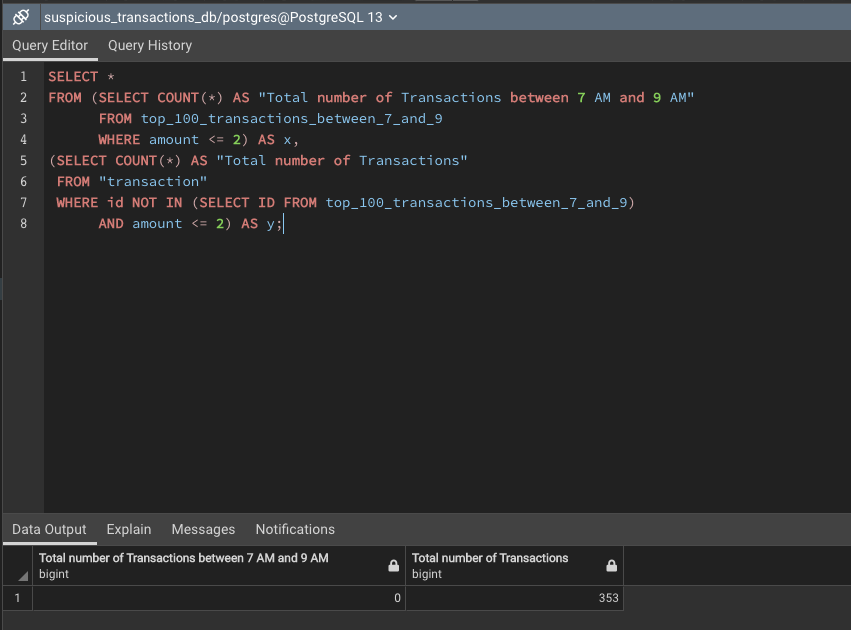

# Suspicious Transactions

## Part 1

### Some fraudsters hack a credit card by making several small transactions (generally less than $2.00), which are typically ignored by cardholders.

*Is there any evidence to suggest that a credit card has been hacked? Explain your rationale.
There seems to be a lot of transactions per cardholder which are less than $2. That would suggest that some of the information might be comprised but more investigations need to be done before it can be properly concluded whether or not credit cards are hacked.

### Take your investigation a step futher by considering the time period in which potentially fraudulent transactions are made.

* Do you see any anomalous transactions that could be fraudulent?
There is still no conclusive evidence that any of the transactions are fraudulent.

* Is there a higher number of fraudulent transactions made during this time frame versus the rest of the day?
There are zero transactions which are less than $2 made during this time as compared to 353 transactions made outside 7 AM and 9 AM. This indicates more fraudulent transactions occur before 7 AM and after 9 AM.

* If you answered yes to the previous question, explain why you think there might be fraudulent transactions during this time frame.
There 353 transactions that are less than $2 which could be evidence of credit card information being stolen.

## Part 2

### The two most important customers of the firm may have been hacked. Verify if there are any fraudulent transactions in their history. For privacy reasons, you only know that their cardholder IDs are 2 and 18.

* What difference do you observe between the consumption patterns? Does the difference suggest a fraudulent transaction? Explain your rationale.
Cardholder ID 18 has got more anomalous transactions as there they have transactions in the range of 1000$ regularly i.e. atleast once per month if not more. This cardholder's information is highly likely compromised.

### The CEO of the biggest customer of the firm suspects that someone has used her corporate credit card without authorization in the first quarter of 2018 to pay quite expensive restaurant bills. Again, for privacy reasons, you know only that the cardholder ID in question is 25.

* Are there any outliers for cardholder ID 25? How many outliers are there per month?
There are few outliers for this cardholder. No. of outliers per month are:
  1. January : 1
  2. February : 0
  3. March : 1
  4. April : 3
  5. May : 1
  6. June : 3

* Do you notice any anomalies? Describe your observations and conclusions.
Yes, there lot of outliers from January to June which suggests fraudulent transactions. Some of them might be legitimate transactions but transactions in April and June which are over 1000$ are more likely the fraudulent ones as spending behaviour doesn't show that the customer is likely spending that much amount per transaction.
